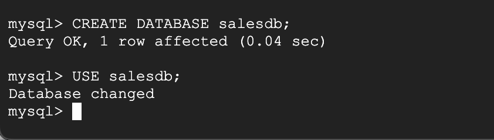
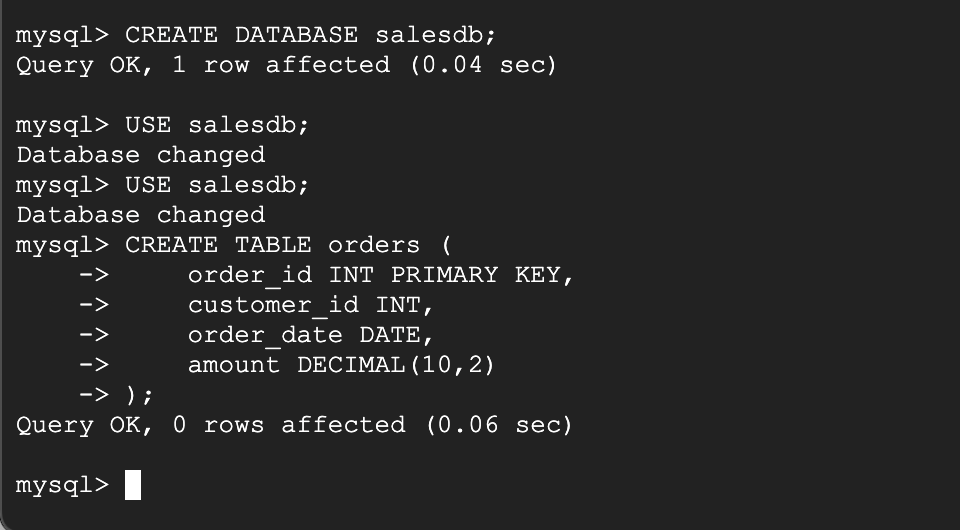
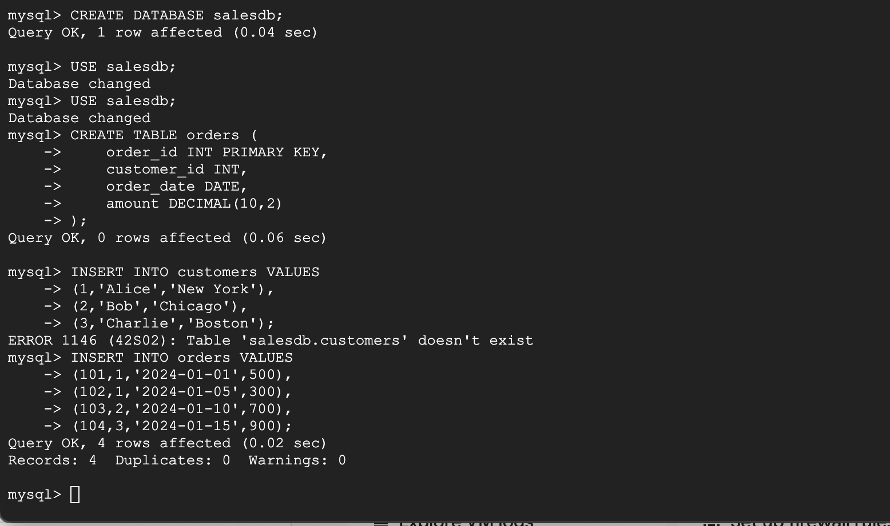
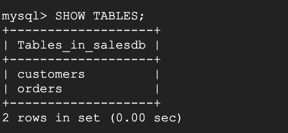
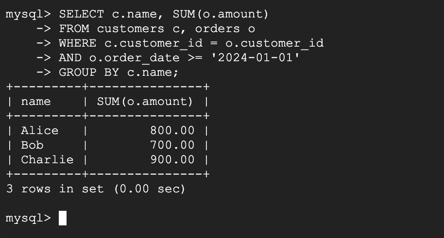
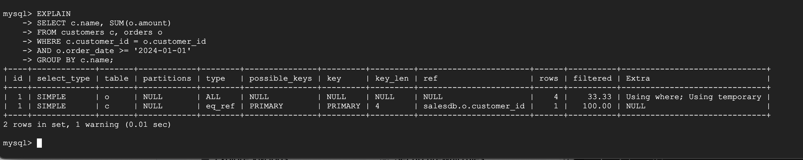
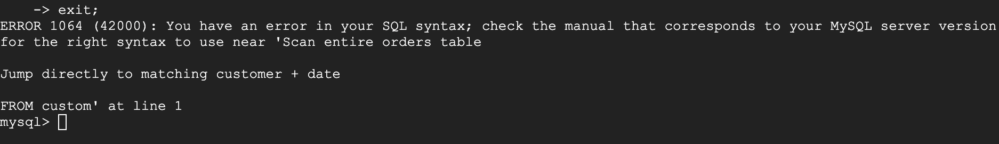
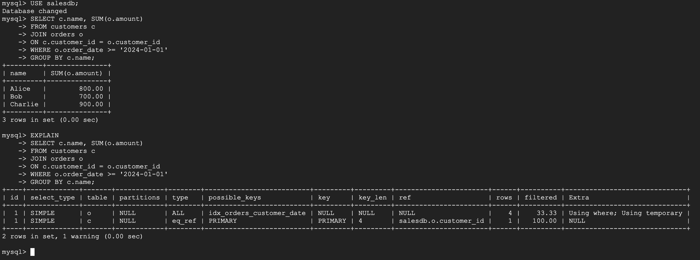

# Database Issue Troubleshooting & SQL Performance Optimization

## Overview
This project demonstrates a real-world database support scenario where a reporting SQL query was performing inefficiently due to missing indexes and non-optimized SQL joins.

The objective of this project is to simulate how a Database Support Engineer or DBA investigates slow SQL queries, analyzes execution plans, applies performance optimizations, and validates improvements.

Although MySQL is used in this lab, the same concepts directly apply to Oracle and other enterprise databases.

---

## Real-World Scenario
A company’s sales reporting dashboard was experiencing slow performance. Business users reported delays while generating customer-wise sales reports.

As part of the database support team, my responsibilities were:
- Identify the slow SQL query
- Analyze the execution plan
- Optimize the query using indexing and SQL best practices
- Validate the performance improvement

---

## Environment
- Operating System: Linux (Kali Linux on VMware)
- Database: MySQL 8.x
- Tools: MySQL Command Line Client
- Concepts: SQL, Indexing, Joins, Execution Plans

---

## Database Setup
The database contains two tables:
- customers – stores customer information
- orders – stores transactional order data

Each customer can have multiple orders.

### Database Setup Screenshots




---

## Problem Statement
A reporting query that calculates total sales per customer was identified as a performance bottleneck.

### Issues Observed
- Full table scans on the orders table
- Missing index on join and filter columns
- Legacy join syntax

### Slow Query Screenshot


---

## Slow Query (Before Optimization)
```sql
SELECT c.name, SUM(o.amount)
FROM customers c, orders o
WHERE c.customer_id = o.customer_id
AND o.order_date >= '2024-01-01'
GROUP BY c.name;
```

---

## Execution Plan Analysis (Before Optimization)
The query execution plan was analyzed using the EXPLAIN command.

Findings:
- type = ALL indicating full table scans
- No effective index usage
- Temporary tables used for aggregation

### EXPLAIN Output (Before Optimization)


---

## Optimization Steps

### Index Creation
A composite index was created to optimize join and date filter conditions.

```sql
CREATE INDEX idx_orders_customer_date
ON orders(customer_id, order_date);
```



---

### Query Rewrite Using ANSI JOIN
The query was rewritten using ANSI join syntax for better readability and optimizer efficiency.

```sql
SELECT c.name, SUM(o.amount)
FROM customers c
JOIN orders o
ON c.customer_id = o.customer_id
WHERE o.order_date >= '2024-01-01'
GROUP BY c.name;
```



---

## Execution Plan Analysis (After Optimization)
After optimization, the execution plan showed improved join strategy and index availability.

Due to the small dataset used in this lab, the optimizer chose a full table scan as it was more cost-effective. In a production-scale environment, the same query would utilize the composite index.




---

## Results and Impact
- Identified the root cause of the slow query using execution plans
- Applied indexing and SQL optimization techniques
- Improved query scalability and maintainability
- Simulated a real-world database troubleshooting workflow

---

## Key Learnings
- Analyzing SQL performance using execution plans
- Designing effective indexing strategies
- Writing optimized and maintainable SQL queries
- Understanding cost-based query optimization

---

## Conclusion
This project demonstrates hands-on experience with SQL performance troubleshooting, a critical skill for database support and backend engineering roles.
